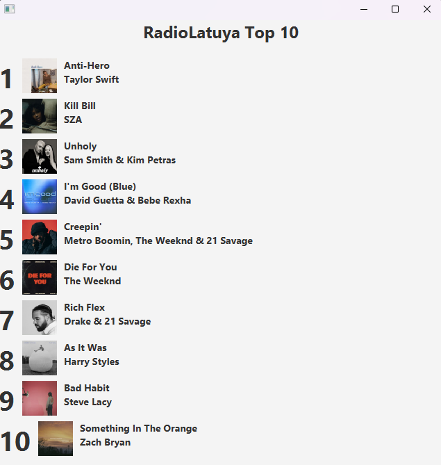

Integrantes y roles

Complete esta tabla al final del taller.

| Rol | Nombre | Usuario de GitHub | Commit principal |
| --- | --- | --- | --- |
| Líder | Luis Lucio | LAA900 | Reemplazo del titulo a RadioLatuya |
| Integrante 1 | Victor Ponce | VicPon76 | Cambiar el numero de posicion |
| Integrante 2 |  |  |  |
| Integrante 3 |  |  |  |
| Integrante 4 |  |  |  |

## Evidencias

Coloque las capturas dentro de una carpeta llamada `capturas/` y enláselas en esta sección.

### Líder

Cambio:

### Integrante 1

Error antes de resolver conflicto:

Push exitoso después de resolver conflicto:

## Integrante 3
Cambio:

Error por conflicto:

Push exitoso despues de resolver el conflicto:

